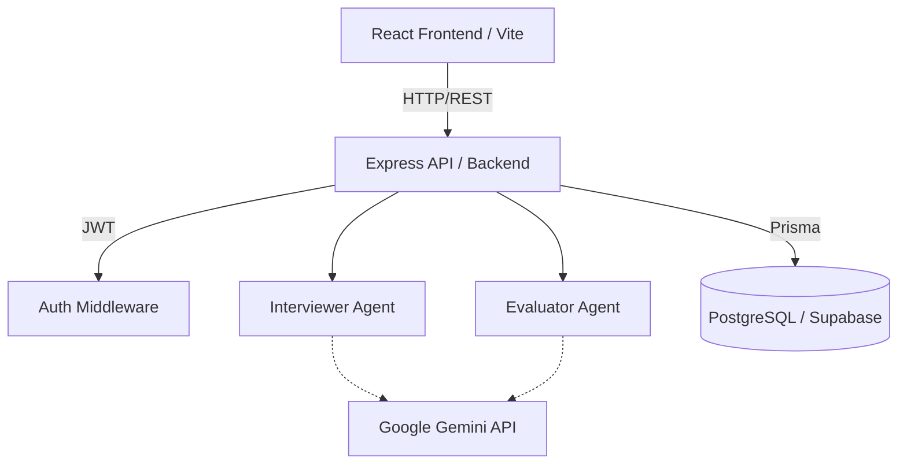

# Mock-Viva & Code-Review Assistant (SaaS)

This project is a Full-Stack SaaS web application designed to act as a mock-viva examiner and code-review assistant. It helps developers practice technical interviews and automated code reviews focused on architectural decisions, powered by LLM Agents (Google Gemini API).

## Core Features

- **Cloud-Ready Architecture**: Decoupled React frontend (Vite/Tailwind) and Express backend API.
- **Persistent History**: Uses PostgreSQL (via Prisma) to store users, projects, and viva sessions.
- **Interactive Interviewing**: An "Interviewer" agent analyzes provided code context and asks architectural/logic-based questions.
- **Evaluation & Feedback**: An "Evaluator" agent grades the developer's answers and provides constructive feedback.
- **Modern Dashboard**: A dashboard to track average scores, total projects reviewed, and past sessions.

## Architecture

The system follows a modern full-stack web application architecture where a React Frontend communicates with a Node.js/Express Backend, which in turn acts as the orchestrator between the LLM agents and the database.



### Components

- **React Frontend**: Built with React, Vite, and Tailwind CSS. Manages the UI, state, and handles routing securely with JWT.
- **Express API Backend**: Built with Node.js and Express. Exposes REST endpoints (`/api/login`, `/api/viva/start`, etc.) and handles authentication.
- **Database Layer**: Uses Prisma ORM connected to PostgreSQL (e.g., Supabase) for relational data management.
- **LLM Agents**:
  - **Interviewer Agent**: Analyzes code context via Gemini API and generates targeted questions.
  - **Evaluator Agent**: Reviews user answers against context and provides structured JSON feedback.

## User Flow

1. **Authentication**: User logs in or registers via the secure JWT-based login screen.
2. **Dashboard**: User lands on the analytics dashboard to view past performance.
3. **Initialization**: User starts a new Viva Session and provides their target codebase context.
4. **Questioning**: The backend Interviewer formulates questions about the code and sends them to the UI.
5. **Answering**: User types their responses into the interactive interface.
6. **Evaluation**: The backend Evaluator grades the responses, saves the result to the database, and returns the feedback.
7. **Review**: The user views their final score, passing status, and areas for improvement.

## Setup Instructions

1. Install dependencies for the backend and frontend:
   ```bash
   npm install
   cd frontend
   npm install
   cd ..
   ```

2. Set up environment variables (`.env`):
   ```env
   DATABASE_URL="your-postgresql-url"
   JWT_SECRET="your-secret-key"
   GEMINI_API_KEY="your-gemini-key"
   ```

3. Run Prisma Migrations:
   ```bash
   npx prisma migrate dev
   ```

4. Start the application backend and frontend:
   ```bash
   # Run backend
   npm run dev

   # Open a new terminal and run frontend
   cd frontend
   npm run dev
   ```
