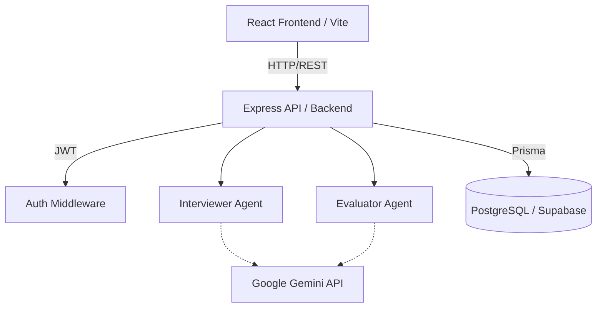

# Architecture Breakdown

## 1. High-Level Architecture
The system follows a modern full-stack web application architecture where a React Frontend communicates with a Node.js/Express Backend, which in turn acts as the orchestrator between the LLM agents and the database.

## 2. Components

### 2.1 React Frontend
- Built with React, Vite, and Tailwind CSS.
- Manages the user interface and state (Login, Dashboard, Viva Session).
- Stores JWT securely and handles routing.

### 2.2 Express API Backend
- Built with Node.js and Express.
- Exposes RESTful endpoints (`/api/login`, `/api/viva/start`, `/api/viva/evaluate`, `/api/stats`).
- Secures routes with JWT middleware.

### 2.3 Database Layer (Prisma & Supabase)
- Uses Prisma ORM to connect to a hosted PostgreSQL database (e.g., Supabase).
- Maintains relational data for `User`, `Project`, and `VivaSession`.

### 2.4 Agents
- **Interviewer Agent**: Generates 3 questions based on the provided codebase context via Google Gemini API.
- **Evaluator Agent**: Reviews the answers against context and outputs structured JSON feedback.

## 3. Data Flow
1. User authenticates via the frontend and receives a JWT.
2. User provides target codebase context (via UI input) to `/api/viva/start`.
3. Backend invokes the Interviewer Agent to generate 3 questions.
4. UI displays questions; user provides answers.
5. UI submits answers to `/api/viva/evaluate`.
6. Evaluator grades the responses and the backend saves the results via Prisma.
7. Dashboard fetches `/api/stats` to display historical performance.
